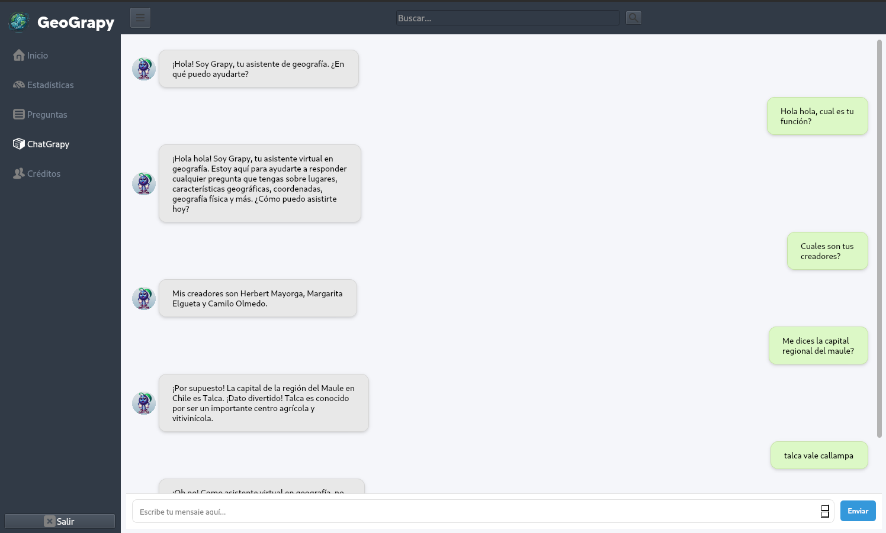

# GeoGrapy

Una aplicación educativa de geografía desarrollada con PyQt6.



## Características
- Quiz interactivo sobre países y capitales
- Chat asistente de geografía
- Interfaz moderna y amigable
- Sistema de puntuación y niveles

## Instalación
```bash
pip install -r requirements.txt
