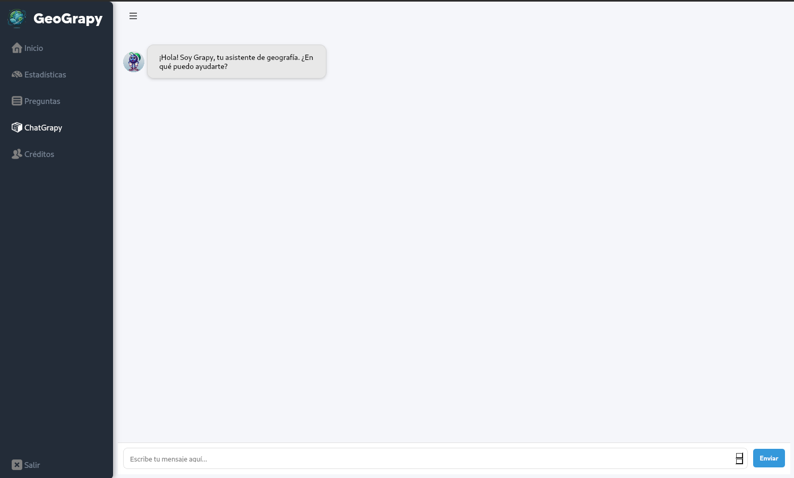

# GeoGrapy

Una aplicación educativa de geografía desarrollada con PyQt6.

Está enfocado en fomentar la cultura general en temas de geografía con un aprendizaje interactivo, debido al diseño y naturaleza de la app, esta dirigida hacia un publico de entre 8 y 14 años, beneficiándose de ella todo tipo de escuelas al integrarla a su plan de estudio como una herramienta de apoyo.
Dentro de lo que entrega la app:
1. Se puede visualizar el mapamundi, al dar click en algún país se puede ver información relacionada y un dato curioso
2. Cuestionarios para aumentar el conocimiento de manera entretenida, con sistema de recompensas y acumulación de experiencia para subir niveles  
3. Estadísticas de avance, nivel, títulos y medallas del usuario 
4. Inteligencia Artificial añadida para resolver toda clase de dudas sobre geografía
5. Un apartado de notas para poder guardar todo tipo de información que el usuario estime de valor



## Características
- Quiz interactivo sobre países y capitales
- Chat asistente de geografía
- Interfaz moderna y amigable
- Sistema de puntuación y niveles

## Instalación
```bash
pip install -r requirements.txt

## Ejecutar la aplicación
```bash
python run.py
```
